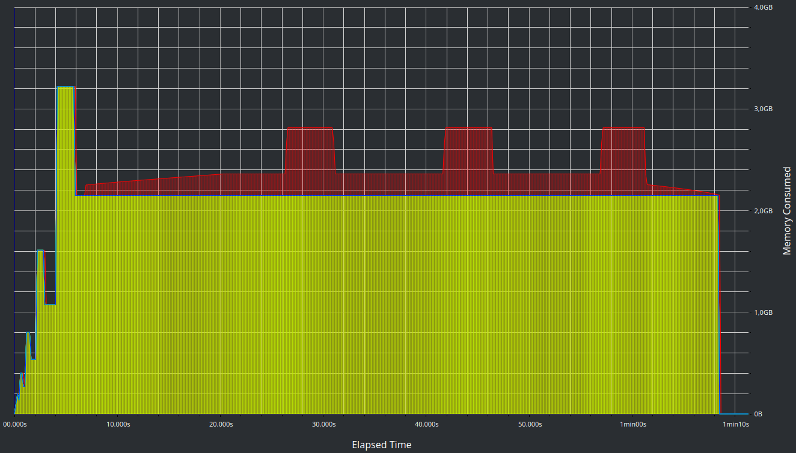

### build
    g++ src/main.cpp -o <prog_name>
### run unit-tests
    ./<prog_name> -test
### run bench
    ./<prog_name> -bench

## Идея
1) каждая нода хранит вектор из номеров нод, с которыми она связана

2) каждая нода хранит объем своего ресурса

3) т.к. сценарий подразумевает большое количество добавлений/удалений связей между нодами можно обновлять количество разделяемого ресурса только в моменты, когда характер изменений меняется(удаляли связи --> начали добавлять связи или наоборот) и в моменты, когда нужно отобразить состояние нод. 

4) обновление состояния разделяемого между нодами ресурса делается через структуру данных [DSU](https://en.wikipedia.org/wiki/Disjoint-set_data_structure) и алгоритм построения [MST](https://en.wikipedia.org/wiki/Minimum_spanning_tree). Когда нужно обновить состояние делается построение MST со своими представителями, каждый из которых подсчитывает суммарный объем разделяемого ресурса в его дереве и количество подключенных к его дереву нод.

## Оптимизация
Для оптимизации можно использовать скрипт run_test.sh, который запускает flamegraph

#### установка Flamegraph
```C
cd ~
git clone https://github.com/brendangregg/FlameGraph
```

#### запуск скрипта
```C
chmod +x run_perf_test.sh
./run_perf_test.sh <prog_name>
```
результатом работы которого является подобный флеймграф:
<details>
<summary>флеймграф</summary>
    
</details> 


## Использование памяти
Отследить использование памяти можно с помощью heaptrack
#### установка на Ubuntu:
```C
sudo apt install heaptrack
```
#### сборка профиля и просмотр
```C
heaptrack ./<prog_name> -bench
```


<details>
<summary>график из heaptrack</summary>
    
</details>

По графику видно, что максимальное использование памяти равно 3.2 гб, а среднее примерно 2.6 гб.