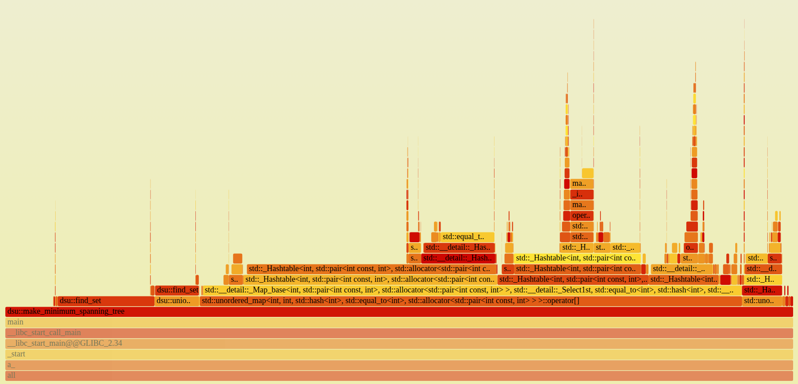

## Идея
    1) каждая нода хранит вектор из номеров нод, с которыми она связана

    2) каждая нода хранит объем своего ресурса

    3) т.к. сценарий подразумевает большое количество добавлений/удалений связей между нодами можно обновлять количество разделяемого ресурса только в моменты, когда характер изменений меняется(удаляли связи --> начали добавлять связи или наоборот) и в моменты, когда нужно отобразить состояние нод. 

    4) обновление состояния разделяемого между нодами ресурса делается через немного измененные алгоритмы DSU и Краскала. Когда нужно обновить состояние делается построение minimum spanning trees со своими представителями, каждый из которых подсчитывает суммарный объем разделяемого ресурса в его дереве и количество подключенных к его деревву нод.

## Оптимизация
время работы первой версии: 
```C
Create nodes: 6 sec
Initial fill: 0 sec
Add connections: 7 sec
First balancing: 10 sec
Add water: 4 sec
Second balancing: 10 sec
Remove edges: 1 sec
Add water again: 4 sec
Final balancing: 8 sec
TOTAL: 53 sec
```
<details>
<summary>флеймграф</summary>
    
</details> 
Как можно увидеть по этому флеймграфу главным источником задержки первой версии программы является операция [ ] в хеш-таблице:

```C++
    // balance the amount of the shared resource
    std::unordered_map<int32_t, int32_t> sum;   // root -> sum of volumes
    std::unordered_map<int32_t, int32_t> count; // root -> number of nodes

    // 1. calculate the amounts and sizes of the components
    for (int32_t i = 0; i < nodes_.size(); ++i) {
        int32_t root = find_set(i);
        sum[root] += nodes_[i].volume_;
        count[root] += 1;
    }

    // 2. write the average value to each vertex
    for (int32_t i = 0; i < nodes_.size(); ++i) {
        int32_t root = find_set(i);
        nodes_[i].volume_ = sum[root] / count[root]; // integer division
    }
```

заменим на работу с векторами:

```C++
    // balance the amount of the shared resource
    int32_t n = nodes_.size();

    std::vector<int64_t> sum(n, 0);
    std::vector<int32_t> count(n, 0);

    // 1. compressing paths
    for (int32_t i = 0; i < n; ++i) {
        nodes_[i].parent_ = find_set(i);
    }

    // 2. count the amounts and sizes
    for (int32_t i = 0; i < n; ++i) {
        int32_t root = nodes_[i].parent_;
        sum[root] += nodes_[i].volume_;
        count[root] += 1;
    }

    // 3. write the average
    for (int32_t i = 0; i < n; ++i) {
        int32_t root = nodes_[i].parent_;
        nodes_[i].volume_ = sum[root] / count[root];
    }
```

время работы оптимизированной версии: 
```C

```

итог: время работы сценария уменьшилось со 170 секунд до 60.